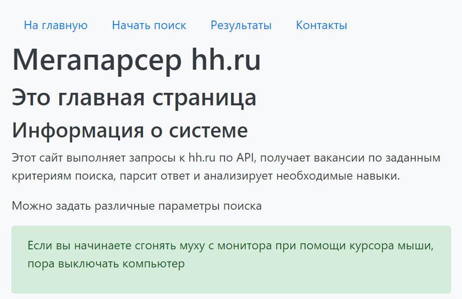
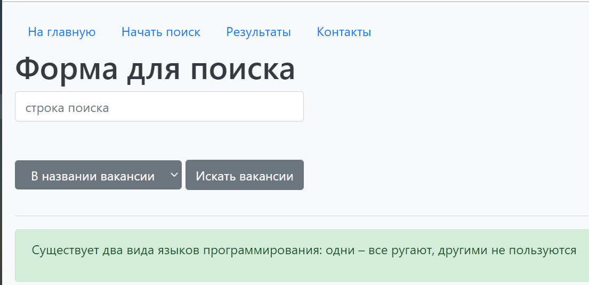
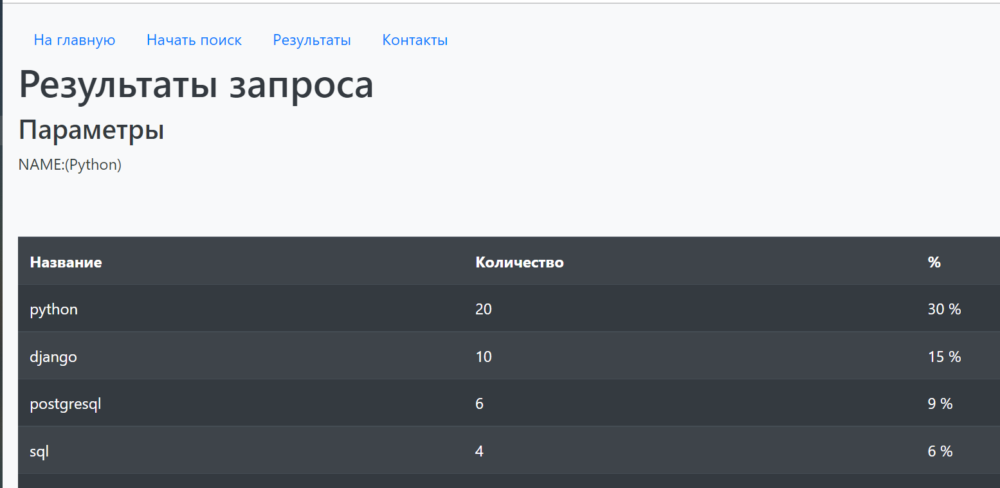
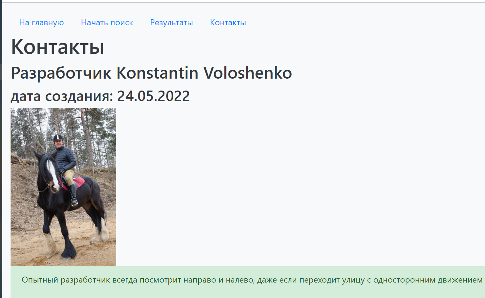

# PDD_19_hw
Python: Multiple inheritance, descriptors, metaclasses, slots
# Web site on Flask for collecting skills from hh.ru
## Description
This site performs requests to hh.ru via api, gets vacancies for given search criteria, parses the response and analyzes the required skills.
## How to start
Run main.py
## Dependencies
Used modules: 
* hhru.all_data
* sqlite.database_access
    
Each request to hh.ru persists to the database (see sqlite/hh_db_orm.sqlite) via ORM SQLAlchemy.
Then the last request is read from the database and displayed on the page.
The last request is additionally written to the file hhru_rezult.json.

## Site structure
The site consists of four pages:
* index.html
* form.html
* results.html
* contacts.html

